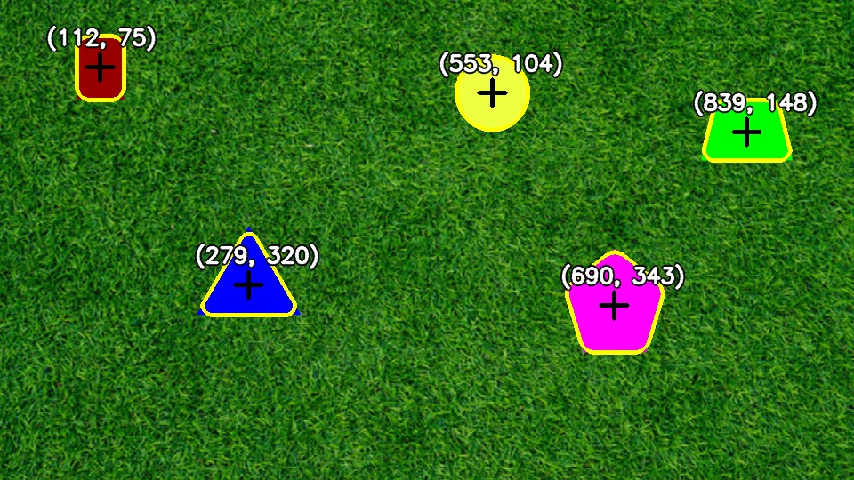
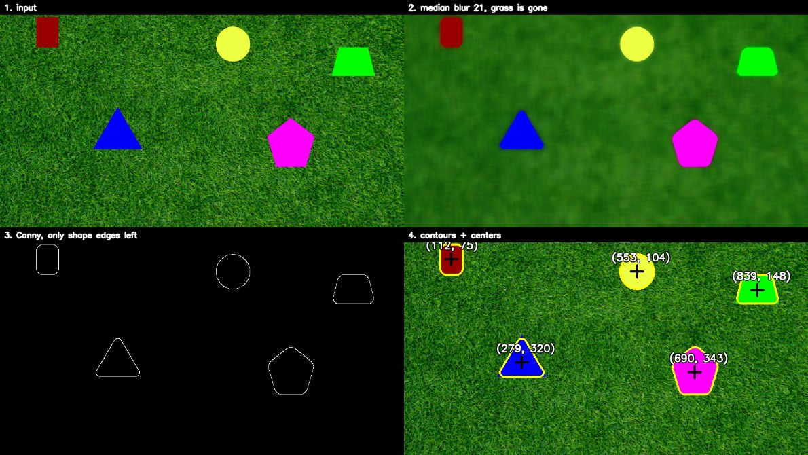
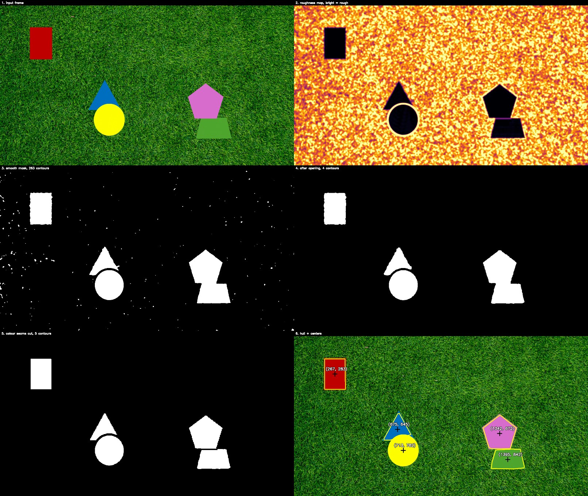
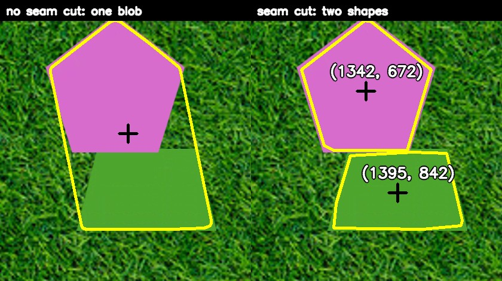
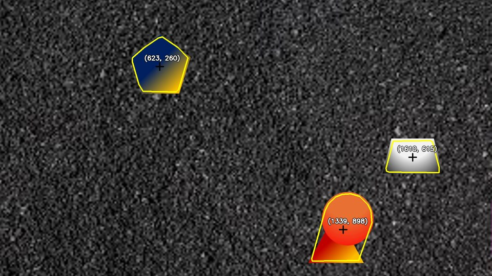
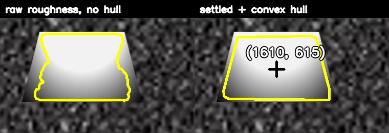
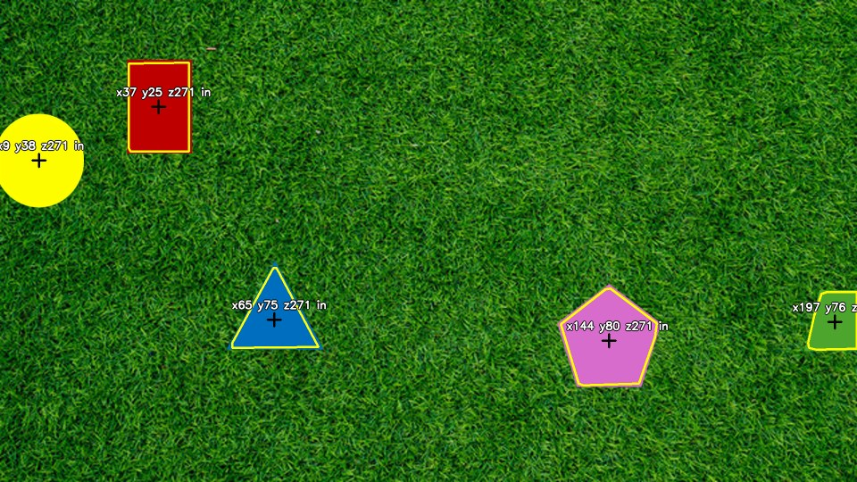
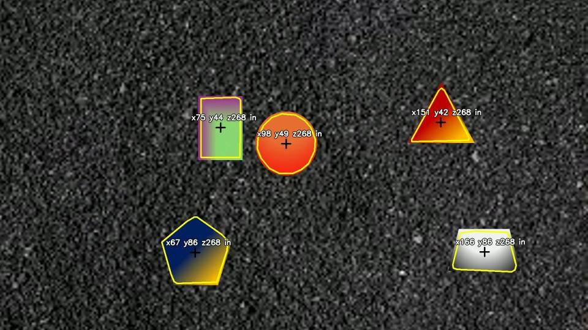

# PennAir 2024 application

Shape detection in OpenCV. The whole thing runs on one idea: the shapes are
smooth and the backgrounds are not, so instead of looking for a colour I
measure how rough each pixel's neighbourhood is and keep the flat parts.

## AI use

I used Claude heavily while building this. The workflow was me deciding what
to try and what the numbers meant, and the model doing the implementation and
the measuring. It was good at running experiments quickly, for example
sweeping a threshold across the whole video and reporting counts, and bad at
knowing on its own which part of a pipeline was actually broken. Most of the
useful steps below came from looking at an intermediate image and noticing
something wrong with it, not from asking for a better algorithm.

*(Raghav: edit this paragraph so it describes your side of it accurately.)*

## What is where

| Folder | Content |
|---|---|
| `part1/` | `detect.py`, the static image detector (blur + Canny) |
| `part2/` | `detect_video1.py`, the texture detector, run frame by frame on the grass video |
| `part3/` | `detect_video2.py`, the same detector on the gravel video |
| `part4/` | `detect_3d.py`, adds depth and X/Y in inches from the camera matrix |
| `part5/pennair_shapes/` | ROS 2 package: publisher node, detector node, recorder node, launch file |
| `files/` | the input image and the two input videos |
| `docs/` | the pipeline stage images used in this README |

Each part grew out of the one before it. Parts 3 and 4 are part 2's file with
the input swapped or the 3D maths bolted on, and part 5 imports the same
detector rather than keeping its own copy.

## Running it

Needs Python 3, OpenCV, NumPy and `imageio-ffmpeg` (for writing H.264 video):

```bash
pip install opencv-python numpy imageio-ffmpeg
```

Run everything from the repo root:

```bash
python part1/detect.py
python part2/detect_video1.py
python part3/detect_video2.py
python part4/detect_3d.py
```

Each script has its input and output paths at the top of the file. The video
scripts take about 2 minutes each for 1840 frames of 1080p.

ROS 2 (ROS 2 Humble on Ubuntu 22.04 under WSL2):

```bash
mkdir -p ~/ros2_ws/src
cp -r part5/pennair_shapes ~/ros2_ws/src/
cd ~/ros2_ws
colcon build --packages-select pennair_shapes
source install/setup.bash

ros2 launch pennair_shapes shapes.launch.py \
    video:=/abs/path/to/PennAir\ 2024\ App\ Dynamic\ Hard.mp4 \
    output:=$HOME/output_ros.mp4
```

---

## Part 1: static image



Median blur with a 21 px kernel, then Canny, then contours, then centroids
from image moments.

The reason it works is that grass is fine texture and the shapes are large
flat areas. A median filter replaces each pixel with the median of its
neighbours, so a kernel wider than a blade of grass turns the grass into flat
green while the shapes are far too big to be affected. Once the background is
flat, the only edges left in the picture are the shape outlines, and Canny
finds exactly those.



A median blur and not a Gaussian: an averaging blur drags edges toward the
background, a median one does not, so the outlines stay where they are.

| Tried | What happened | Kept |
|---|---|---|
| HSV threshold for "not green" | misses the green trapezoid completely | no |
| median blur 21 + Canny | all 5 shapes, centers correct | yes |
| blur kernel 11, 15, 21, 31 | all four find 5 shapes, centers within a pixel | 21, it is the middle |
| Otsu instead of a fixed threshold | returns the whole frame as one blob | no |

The blur size is not a magic number, which is the point of testing four of
them. Otsu failing is worth knowing about: it assumes two comparable groups of
pixels, and the shapes are a small minority, so it splits the *grass's own*
brightness range down the middle instead of separating shapes from grass.

## Part 2: video

<!-- paste the uploaded URL of part2/output_annotated.mp4 on the next line -->

The runner reads a frame, detects, draws, writes, and moves on. Nothing is
buffered and no frame looks at any other frame, so the same code would run on
a live camera by pointing `VIDEO` at a device index.

**Part 1's detector does not work here.** It finds only 1 to 4 of the 5 shapes,
because this video's trapezoid is a muted green. After blurring it reads
(45, 165, 78) against grass at (18, 113, 46), which is too weak a step for
Canny to call an edge.

So the test changes from *edges* to *texture*. For each pixel I take the
standard deviation of its 9x9 neighbourhood:

```
std = sqrt(average of squares - square of the average)
```

Both averages are box filters, so this costs two blurs no matter how big the
window is. Grass scores about 20. A flat shape scores about 0.3, and that
trapezoid scores 0.32 even though its colour nearly matches the grass.



The contour counts in that image are the interesting part. The raw mask has
**263** contours because grass contains thousands of small smooth patches. The
opening takes it to **4**, and the colour seam step to **5**.

**The opening** is an erode followed by a dilate. The erode shaves a layer off
everything, which deletes the specks outright and snaps the thin bridges where
one has stuck to a shape. The dilate then grows whatever survived back to full
size, so the shapes come out unharmed. That "removes small things without
shrinking big ones" property is why it beats blurring the mask.

**The colour seam step** fixes overlaps. Two shapes that touch come out as one
blob, because the seam between them is smooth too. In grayscale the magenta
pentagon is 105 and the green trapezoid is 125, only 20 apart, so the
roughness test cannot see the join. In colour it is obvious, so I take a
morphological gradient (dilate minus erode) of the colour image and cut the
mask wherever it is large. A shape's own interior reads 0 there.



**The convex hull** at the end straightens leftover wobble, and because every
shape in this task is convex it also fills back in whatever another shape is
covering. That is what keeps the centre of a partly covered shape correct.

| Tried | What happened | Kept |
|---|---|---|
| Part 1 detector on the video | 1 to 4 of 5 shapes, trapezoid edge too weak | no |
| roughness (local standard deviation) | all 5, works on the trapezoid | yes |
| Otsu on the roughness map | whole frame as one blob, same reason as Part 1 | no |
| threshold at 55% of the frame's own median roughness | adapts to the scene, no fixed constant | yes |
| per-channel roughness instead of gray | slightly better edges, 110 ms/frame against 11 | no |
| `(rough < t) * 255` | that `* 255` makes an int64 array, 12.1 ms/frame | no |
| `(rough < t)` as uint8 | 2.4 ms, identical contours, findContours takes any non-zero | yes |
| full frame median for the threshold | 18 ms/frame on its own | no |
| median of every 8th pixel | 19.37 against 19.34, free | yes |
| opening at full resolution, 17 px kernel | same result, 7.3 ms | no |
| opening at half resolution, 9 px kernel | same reach, 0.9 ms | yes |
| no opening at all | 263 contours a frame instead of 5 | no |
| convex hull on each contour | straightens edges, fills in covered parts | yes |
| colour seam cut | overlapping shapes separate | yes |

The half resolution trick is not only about speed. A 9 px kernel on a half
size mask reaches as far as a 17 px one would at full size, so it buys the
wider reach and the speed at the same time.

## Part 3: hard background



<!-- paste the uploaded URL of part3/output_annotated_2.mp4 on the next line -->

Same detector, different file. The only changes are the input path and
`MIN_AREA`, which I lowered so shapes half off the edge of the frame still
count.

This video is harder in two ways at once, and both squeeze the same gap:

- the shapes are filled with **gradients** instead of flat colour, so their
  insides are no longer perfectly flat
- **gravel is less rough than grass**, so the background comes down to meet them

Measured on real frames:

| Scene | Shape interior (p95) | Background (p5) | Separation |
|---|---|---|---|
| grass | 0.00 | 14.47 | 1447x |
| gravel | 3.99 | 9.40 | 2.4x |

On grass the threshold sits in an enormous empty gap so every pixel is
unambiguous. On gravel the gap nearly closes: 12% of each frame sits within
20% of the threshold, against 7% on grass, and those uncertain pixels are
exactly the ones along the shape edges.

The place it showed up worst was the grey trapezoid, which has a radial
vignette and sits on grey gravel. Its outline wandered:



Two changes fixed it. **Blurring the roughness map** before thresholding, since
roughness is a measurement and at a low contrast edge it is a noisy one. And
the **convex hull**, which bridges whatever dents are left. Raggedness (drawn
perimeter divided by the perimeter of a circle of the same area, so 1.0 is
perfectly smooth) went from 1.210 to 1.144 across the video, and the
trapezoid's outline went from a wandering 17 point curve to a clean 8 point
trapezoid, with its measured width recovering from 186 px to 208 px.

| Tried | What happened | Kept |
|---|---|---|
| Part 2 settings unchanged | gradient shapes only partly detected | no |
| flatness threshold 0.25 | catches only the flattest part of each gradient | no |
| flatness 0.40 | better, grey trapezoid still cut short | no |
| flatness 0.55 | whole shapes, no gravel leaking in | yes |
| flatness 0.75 | gravel starts passing, 8 or 9 blobs a frame | no |
| bigger roughness window (15) | shapes shrink | no |
| blur the roughness map first | steadier edges, shapes keep their size | yes |
| blur the binary mask instead | same result, slower | no |
| convex hull | straight edges on every shape | yes |

The one case still not handled: **two overlapping shapes of similar colour**
have no colour seam to cut, so the orange circle sitting on the red-orange
triangle stays one blob. The navy pentagon's edge on dark gravel is also
ragged, because navy and gravel are 14 grey levels apart while the yellow half
of the same shape is 102 from the background. That one is fixable in
principle: the blue channel difference at that edge is 78, not 14, so
per-channel roughness would see it. I did not do it because it costs about
10x more per frame.

## Part 4: 3D



<!-- paste the uploaded URL of part4/output_3d.mp4 on the next line -->

Labels are x, y, z in inches in the camera frame.

A pinhole camera puts a 3D point on the image at

```
u = fx * X/Z + cx        v = fy * Y/Z + cy
```

Running that backwards gives X and Y, but only if Z is already known. One
photo cannot tell a small close object from a big far one, so depth has to
come from somewhere else.

The circle is that somewhere. It is 10 inches in radius, so
`Z = f * 10 / radius_in_pixels`, which is just similar triangles. The task
says the surface is flat, so every shape gets that same Z, and then X and Y
fall out of the two equations above.

Finding the circle needs no shape classifier. Circularity is
`4 * pi * area / perimeter^2`, which is exactly 1.0 for a perfect circle and
lower for anything else. Measured here the circle scores **0.985** and the next
best shape **0.886**, so a 0.95 cutoff has a lot of room.

Two checks that the answer is actually right and not just plausible:

- depth reads **264.6 in at frame 0 and 264.9 in at frame 600**, so it is
  stable to about 0.1% over the clip. If the maths were wrong this would drift.
- at Z of about 265 in, the frame should cover `1920 * Z / fx = 198 in` across.
  The measured X values run 18 to 195 in. Consistent.

**Note on the given matrix.** K has `cx = cy = 0`, which puts the principal
point at the top left corner of the image rather than the middle, where a real
camera would have cx = 960, cy = 540. I used K exactly as it was given, which
is why every X and Y comes out positive: they are distances from the corner
ray. Changing `CX, CY` to `width/2, height/2` is a one line change and reports
offsets from the image centre instead. The depth is unaffected either way.

| Tried | What happened | Kept |
|---|---|---|
| circularity to identify the circle | 0.985 against 0.886, clean split | yes |
| radius from `sqrt(area / pi)` | steady frame to frame | yes |
| use K exactly as given | X and Y measured from the image corner | yes, stated assumption |
| hold the last depth when no circle | covers frames where it is hidden or off screen | yes |

On the gravel video the circle is visible in about 9 sampled frames out of 16,
and depth across the whole clip only ranges from 266.8 to 268.7 in, so holding
the last value between sightings costs nothing.

## Part 5: ROS 2



<!-- paste the uploaded URL of part5/output_ros.mp4 on the next line -->

Parts 1 to 4 are one program: read a frame, detect, draw, write. That is fine
for a file but it is not how a drone is built. On a real aircraft the camera
driver, the perception code and the logger are separate programs, sometimes on
separate machines. ROS 2 is what lets them talk without knowing about each
other.

So part 5 is the same detector split the way a real system would be split:

| Node | Subscribes | Publishes | Job |
|---|---|---|---|
| `video_publisher` | - | `/camera/image_raw` | stands in for the camera driver |
| `shape_detector` | `/camera/image_raw` | `/shapes/image`, `/shapes/centers` | the perception node |
| `video_recorder` | `/shapes/image` | - | the logger |

The vision code lives in `detection.py` and the node imports it, so the node
is not a copy of the detector, it *is* the detector with ROS around it. Running
part 3's `find_shapes` and the node's `find_shapes` on the same frame returns
identical areas, `[22512, 33936, 45692]`.

`/shapes/centers` is the topic that matters. It is a `PoseArray` of 3D centres
in inches, which is the machine readable answer. The annotated image is for
humans. Anything else on the network, a navigation node for instance, can
subscribe to the centres and never touch the vision code.

It runs on the hard video, so the output matches part 3 with the 3D labels
added.

| Checked | Result |
|---|---|
| `colcon build` | clean, about 2 s |
| `ros2 node list` | all three nodes come up |
| `ros2 topic echo /shapes/centers --once` | poses with x, y and z in inches |
| published depth against running the detector directly | 265.95 in against a 266.8 to 268.7 range |
| frames recorded | 2000 into `output_ros.mp4` |

One bug worth recording: the first version published every frame with
`stamp: sec 0, nanosec 0` and an empty `frame_id`, because I never filled in
the header. Anything that lines messages up in time or space needs those, so
the publisher now stamps each frame and the detector copies the header onto
the `PoseArray`.

### Throughput

The publisher manages roughly half of the video's 30 fps inside WSL. The
bottleneck is not the algorithm: a 1920x1080 `bgr8` frame is **6.2 MB**, so
30 fps means pushing 186 MB/s through the middleware. A real system would
publish `CompressedImage`, or keep the nodes in one process so the frames are
never serialised. Reading the video across `/mnt/c` is not the problem, I
checked: 141 fps decoding from the Windows drive against 178 fps from the
Linux one.

## Speed

Measured on the best of three passes, 1080p, detection only, on Windows:

| Video | Detect per frame | Rate |
|---|---|---|
| grass, 1837 frames | 41 ms | 24 fps |
| gravel, 1841 frames | 39 ms | 26 fps |

That is just under the 30.3 fps of the source. An earlier version without the
roughness blur, the seam cut and the convex hull ran at about 37 fps, so the
edge quality cost roughly 40% of the speed. Dropping the seam step would get
most of it back if real time mattered more than clean outlines.

The obvious ways to speed it up further would be running the detection on a
half size frame and scaling the contours back up, or moving the pipeline to
C++.

## Video encoding

Worth writing down because it cost a while. OpenCV on Windows has no H.264
encoder of its own, so `cv2.VideoWriter` falls back to whatever it can find:

| Tried | What happened | Kept |
|---|---|---|
| `mp4v` | writes a valid file that Windows players refuse to open | no |
| `avc1` through OpenCV's ffmpeg | fails, needs an OpenH264 DLL that does not match the build | no |
| dropping in OpenH264 1.8.0, 2.0.0, 2.1.0, 2.1.1 | every published build rejected as the wrong version | no |
| `avc1` through Windows Media Foundation | works, but writes Baseline at level 5.0, 464 MB, still refused by some players | no |
| piping raw frames to ffmpeg (`imageio-ffmpeg`) | ordinary High profile yuv420p, 26 to 37 MB | yes |

So the scripts send frames to ffmpeg over a pipe instead of using
`cv2.VideoWriter`. Inside WSL, OpenCV's `avc1` works fine, which is why the
ROS recorder node does use `cv2.VideoWriter`.

## Part 6

Not done. The next thing I would add is tracking between frames, so each shape
keeps an ID and can be predicted through a full occlusion rather than just a
partial one. Right now each frame is judged entirely on its own, which is why
two similar coloured shapes that overlap are indistinguishable from one shape.
